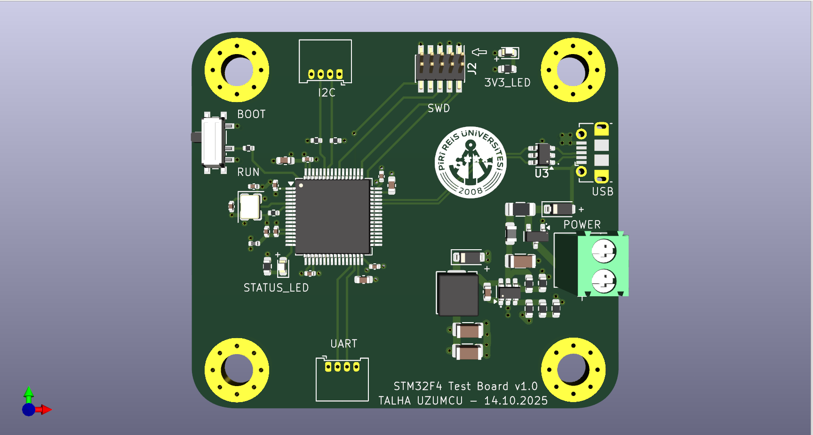
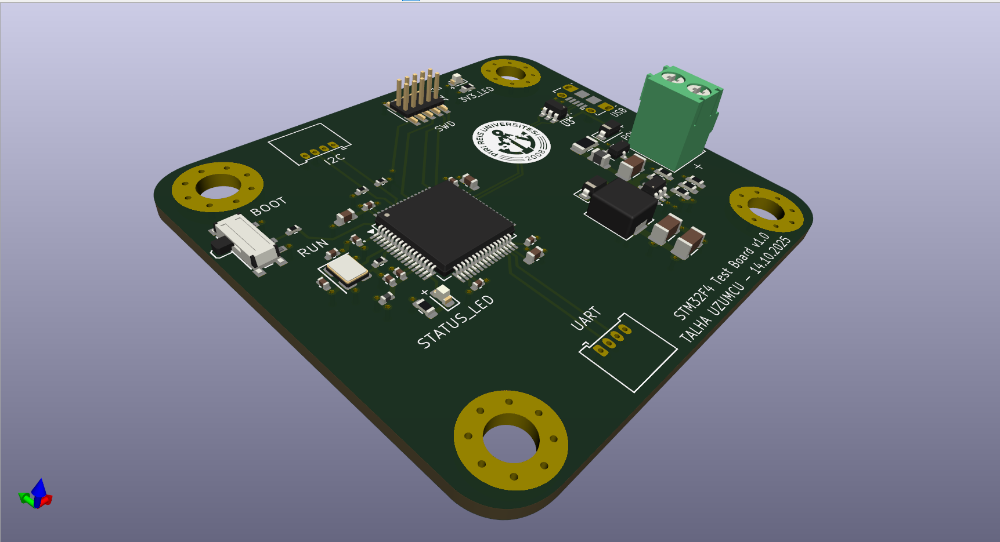
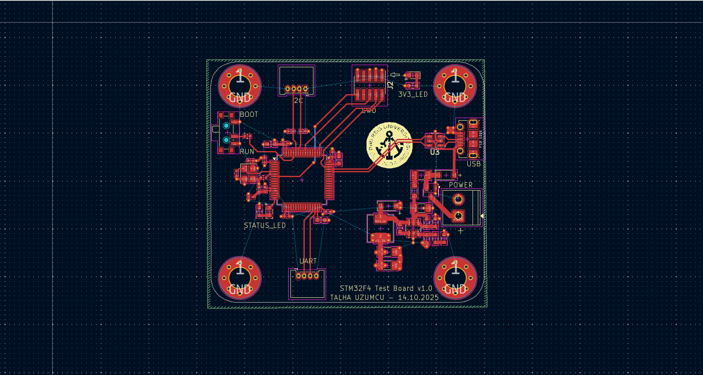

# STM32F4 Test Board with Buck Regulator

This repository contains my KiCad PCB design project for an STM32F4-based test and development board with an integrated buck regulator power section.

The board was designed as a compact embedded systems development platform that includes an STM32F4 microcontroller, programming/debugging interfaces, communication headers, status indicators, and onboard power regulation.

---

## Project Overview

The main purpose of this project was to design a custom STM32F4 test board using KiCad.

The board includes the essential hardware required for working with an STM32F4 microcontroller, such as power input, voltage regulation, SWD programming interface, UART and I2C headers, boot/run control, USB connection, and status LEDs.

This project combines embedded system PCB design and power supply design on a single board.

---

## 3D PCB View

The 3D view shows the physical placement of the STM32F4 microcontroller, SWD header, UART and I2C connectors, USB section, power input terminal, buck regulator components, status LEDs, and mounting holes.

---

## PCB Layout

The PCB layout was created in KiCad.

The STM32F4 microcontroller was placed near the center of the board. Communication and programming headers were positioned around the MCU for easier access. The power regulation section was placed on the right side of the board, close to the power input terminal.

---

## Main Features

- STM32F4 microcontroller-based custom test board
- Integrated buck regulator power section
- SWD programming/debugging connector
- UART communication header
- I2C communication header
- USB connection section
- BOOT and RUN control
- Status LED
- 3.3V power indicator LED
- External power input terminal
- Mounting holes for mechanical fixing

---

## Main Components

- STM32F4 microcontroller
- Buck regulator components
- Inductor
- Power input terminal block
- USB connector section
- SWD header
- UART header
- I2C header
- BOOT switch
- RUN switch
- Status LEDs
- Resistors and capacitors
- Mounting holes

---

## Working Principle

The board is designed around an STM32F4 microcontroller.

The external DC input is connected through the power terminal. The onboard buck regulator section converts the input voltage to the required lower voltage level for the system.

The SWD connector allows the STM32F4 microcontroller to be programmed and debugged. UART and I2C headers provide communication interfaces for external modules, sensors, or other embedded systems.

The BOOT and RUN controls are used during programming, reset, and startup operations. Status LEDs provide visual feedback about the board state and power status.

---

## PCB Design Notes

- The STM32F4 MCU was placed centrally for organized signal routing.
- SWD, UART, and I2C headers were placed near the board edges for easy access.
- The buck regulator section was separated from the microcontroller area.
- Wider traces were used in the power section.
- Mounting holes were added for mechanical stability.
- The board was checked using KiCad 3D Viewer.

---

## What I Learned

Through this project, I gained practical experience in:

- Designing STM32-based embedded system PCBs
- Using KiCad for schematic, PCB layout, and 3D visualization
- Integrating MCU, power, programming, and communication sections
- Designing a buck regulator power stage on the same PCB
- Routing microcontroller signals
- Planning PCB layout for debugging and testing
- Creating a more professional embedded development board structure

---

## Tools and Technologies

- KiCad
- STM32F4
- Buck regulator
- Embedded systems
- PCB design
- SWD programming
- UART communication
- I2C communication
- Power electronics

---

## Author

**Talha Üzümcü**  
Electrical and Electronics Engineer  
GitHub: [talhazmc](https://github.com/talhazmc)
